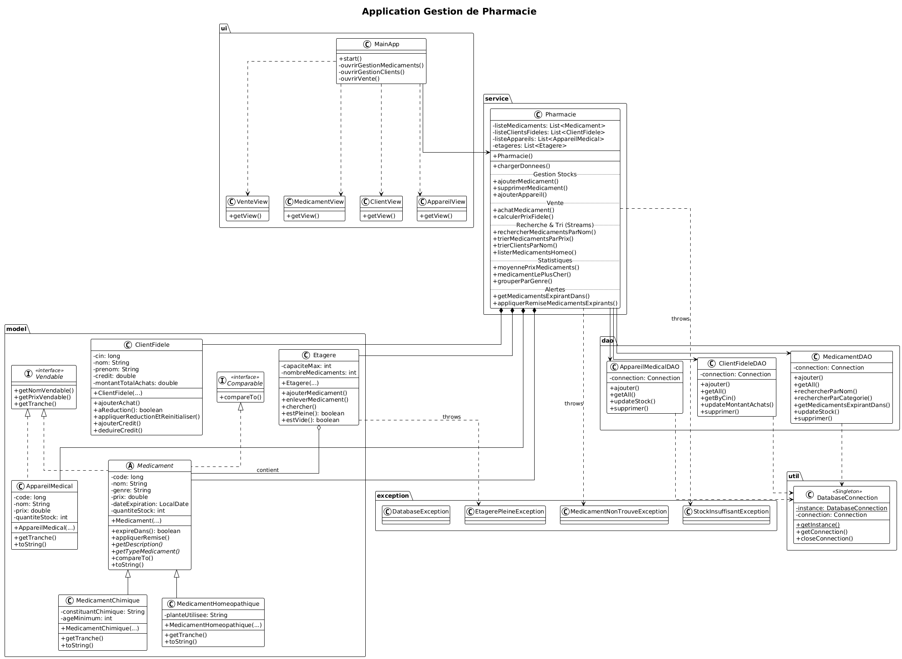

# Mini Projet Pharmacie - Guide d'Installation

## Prérequis

- **Java JDK 21** : Installé dans `C:\Program Files\OpenJDK\jdk-21`
- **Oracle XE** : Base de données avec SQL Developer
- **Eclipse IDE** : Pour l'édition et l'exécution

## Structure du Projet

```
MiniProjetPharmacie/
├── src/
│   ├── model/           # Classes métier
│   │   ├── Medicament.java (abstraite)
│   │   ├── MedicamentChimique.java
│   │   ├── MedicamentHomeopathique.java
│   │   ├── AppareilMedical.java
│   │   ├── ClientFidele.java
│   │   ├── Etagere.java
│   │   └── Vendable.java (interface)
│   ├── dao/             # Accès aux données
│   │   ├── MedicamentDAO.java
│   │   ├── ClientFideleDAO.java
│   │   └── AppareilMedicalDAO.java
│   ├── service/         # Logique métier
│   │   └── Pharmacie.java
│   ├── exception/       # Exceptions personnalisées
│   │   ├── EtagerePleineException.java
│   │   ├── MedicamentNonTrouveException.java
│   │   ├── CreditNegatifException.java
│   │   ├── AchatInterditException.java
│   │   ├── StockInsuffisantException.java
│   │   ├── SaisieInvalideException.java
│   │   └── DatabaseException.java
│   ├── ui/              # Interfaces JavaFX
│   │   ├── MainApp.java (point d'entrée)
│   │   ├── MedicamentView.java
│   │   ├── ClientView.java
│   │   ├── AppareilView.java
│   │   └── VenteView.java
│   └── util/            # Utilitaires
│       └── DatabaseConnection.java
├── sql/
│   └── create_database.sql
└── lib/
    ├── ojdbc11.jar      # À télécharger
    └── javafx-sdk-21/   # À télécharger
```

## Diagramme de classes



## Étape 1 : Télécharger les Dépendances

### 1.1 Driver Oracle JDBC (ojdbc11.jar)

1. Allez sur : https://www.oracle.com/database/technologies/appdev/jdbc-downloads.html
2. Téléchargez **ojdbc11.jar** (pour Java 21)
3. Placez le fichier dans `MiniProjetPharmacie/lib/`

### 1.2 JavaFX SDK 21

1. Allez sur : https://gluonhq.com/products/javafx/
2. Téléchargez **JavaFX SDK 21** pour Windows
3. Décompressez dans `MiniProjetPharmacie/lib/javafx-sdk-21/`

## Étape 2 : Créer la Base de Données

1. Ouvrez **SQL Developer**
2. Connectez-vous avec :
   - Hôte : localhost
   - Port : 1521
   - SID : xe
   - Utilisateur : system
   - Mot de passe : system

3. Ouvrez le fichier `sql/create_database.sql`
4. Exécutez le script (F5 ou bouton "Exécuter")
5. Vérifiez que les tables sont créées :
   ```sql
   SELECT * FROM CLIENT_FIDELE;
   SELECT * FROM MEDICAMENT;
   SELECT * FROM APPAREIL_MEDICAL;
   ```

## Étape 3 : Configurer Eclipse

### 3.1 Créer le Projet

1. **File** → **New** → **Java Project**
2. Nom du projet : `MiniProjetPharmacie`
3. JRE : **JavaSE-21**
4. Cliquez **Finish**

### 3.2 Importer les Sources

1. Supprimez le dossier `src` créé par défaut
2. Copiez le dossier `src` depuis `C:\Projet Java\MiniProjetPharmacie\src`
3. Copiez le dossier `lib` avec les jars

### 3.3 Ajouter les Libraries

1. Clic droit sur le projet → **Properties**
2. **Java Build Path** → **Libraries**
3. Cliquez **Classpath** puis **Add External JARs**
4. Ajoutez `lib/ojdbc11.jar`
5. Cliquez **Add External JARs** à nouveau
6. Naviguez vers `lib/javafx-sdk-21/lib/`
7. Sélectionnez **tous les .jar** (javafx.base.jar, javafx.controls.jar, javafx.fxml.jar, javafx.graphics.jar, etc.)
8. Cliquez **Apply and Close**

### 3.4 Configurer VM Arguments pour JavaFX

1. Clic droit sur `MainApp.java` → **Run As** → **Run Configurations**
2. Onglet **Arguments**
3. Dans **VM arguments**, ajoutez :
```
--module-path "C:/Projet Java/MiniProjetPharmacie/lib/javafx-sdk-21/lib" --add-modules javafx.controls,javafx.fxml
```
4. Cliquez **Apply** puis **Run**

## Étape 4 : Exécuter l'Application

1. Assurez-vous qu'Oracle XE est démarré
2. Ouvrez `src/ui/MainApp.java`
3. Clic droit → **Run As** → **Java Application**

## Fonctionnalités

### Interface d'Accueil
- Affiche les statistiques (nombre de médicaments, clients, appareils)
- Navigation vers les différentes sections

### Gestion des Médicaments
- Ajouter des médicaments (chimiques ou homéopathiques)
- Rechercher par nom, catégorie ou premières lettres
- Afficher les médicaments expirant dans 2 mois
- Appliquer une remise de 30% sur les médicaments expirants

### Gestion des Clients Fidèles
- Ajouter/supprimer des clients
- Rechercher par nom
- Trier par ordre alphabétique (Stream)
- Voir les détails et le statut de réduction

### Gestion des Appareils Médicaux
- Ajouter/supprimer des appareils
- Rechercher par nom
- Facilité de paiement en 3 tranches

### Effectuer une Vente
- Sélectionner un client fidèle
- Acheter des produits avec réductions automatiques
- Réduction 15% quand total achats >= 100 DT

## Réductions Automatiques

| Type de Produit | Client Fidèle |
|-----------------|---------------|
| Médicament Chimique | -20% |
| Médicament Homéopathique | -10% |
| Appareil Médical | 3 tranches |
| Bonus fidélité (>100 DT) | -15% supplémentaire |

## Dépannage

### Erreur "Driver Oracle non trouvé"
- Vérifiez que `ojdbc11.jar` est dans le Build Path

### Erreur "Connection refused"
- Vérifiez qu'Oracle XE est démarré
- Vérifiez les paramètres de connexion dans `DatabaseConnection.java`

### Erreur JavaFX
- Vérifiez les VM arguments
- Vérifiez que tous les JAR JavaFX sont dans le Build Path

### Tables non trouvées
- Exécutez le script SQL dans SQL Developer
- Vérifiez la connexion avec l'utilisateur `system`

## Auteur

Mini Projet Java - 2ème année Génie Informatique
A.U. 2025/2026
